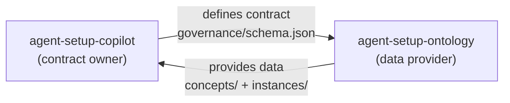
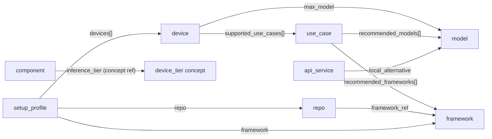

# Governance — agent-setup-copilot

This directory is the **sole owner of the schema contract** that `agent-setup-ontology` must conform to.

> The consumer (agent-setup-copilot) defines the contract.
> The data provider (agent-setup-ontology) manages data to fit this contract.

---

## Repository Hierarchy

```
agent-setup-copilot/          ← contract owner (this repo)
├── governance/
│   ├── GOVERNANCE.md         ← contract document (this file)
│   ├── schema.json           ← formal schema (Source of Truth)
│   └── scripts/
│       └── validate.py       ← canonical validator (CI + ontology harness)
└── skills/agent-setup-copilot/SKILL.md

agent-setup-ontology/         ← data provider
├── concepts/                 ← semantic definitions (what fields mean)
│   ├── use_case.yaml
│   ├── device.yaml
│   ├── model.yaml
│   ├── framework.yaml
│   ├── api_service.yaml
│   ├── component.yaml
│   ├── repo.yaml
│   ├── setup_profile.yaml
│   ├── cost_estimation.yaml  ← schema/formulas only; data values in instances/cost_estimation.yaml
│   ├── usage_input.yaml      ← user input schema; inference_rules live in SKILL.md
│   └── relation.yaml
├── instances/                ← instance data conforming to this contract
│   ├── use_case.yaml
│   ├── device.yaml
│   ├── model.yaml
│   ├── framework.yaml
│   ├── api_service.yaml
│   ├── component.yaml
│   ├── repo.yaml
│   ├── setup_profile.yaml
│   ├── cost_estimation.yaml  ← token usage profiles, thresholds (paired with concepts/)
│   └── relation.yaml
└── skills/ontology-harness/SKILL.md
```



---

## Required Fields

### use_cases

| Field | Type | Description |
|-------|------|-------------|
| `id` | string | Unique identifier (lowercase + underscore) |
| `label` | string | Human-readable name |
| `description` | string | One-line summary |
| `keywords` | string[] | Trigger keywords for intent matching |
| `min_memory_gb` | integer | Minimum RAM required |

### devices

| Field | Type | Description |
|-------|------|-------------|
| `id` | string | Unique identifier |
| `label` | string | Human-readable name |
| `type` | enum | `macbook` \| `mac-mini` \| `mac-studio` \| `pc` \| `ai-supercomputer` \| `other` |
| `memory_gb` | integer | Unified/system memory in GB |
| `tier` | enum | `light` \| `standard` \| `standard-plus` \| `pro` |
| `max_model` | string | Most capable model that runs comfortably (references models[*].id) |

### models

| Field | Type | Description |
|-------|------|-------------|
| `id` | string | Ollama model tag (e.g. `qwen3.5:9b`) |
| `label` | string | Human-readable name |
| `params_b` | number | Total parameter count in billions |
| `type` | enum | `dense` \| `MoE` \| `reasoning` |
| `min_memory_gb` | integer | Minimum RAM to run |
| `quality` | enum | `light` \| `standard` \| `standard-plus` \| `pro` |
| `tool_calling` | boolean | Supports tool/function calling |

### frameworks

| Field | Type | Description |
|-------|------|-------------|
| `id` | string | Unique identifier |
| `label` | string | Human-readable name |
| `kind` | enum | Framework category (see below) |
| `complexity` | enum | `low` \| `medium` \| `high` — setup difficulty |
| `local_capable` | boolean | Can run without an API key (using a local model) |
| `runtime_support` | string[] | Supported runtimes / backends |

#### `kind` values

| Value | Meaning | Examples |
|-------|---------|---------|
| `agent` | General-purpose agent framework | smolagents, CrewAI, LangGraph, qwen-agent, AutoGen, Agno |
| `automation` | Browser / file / code automation wrapper | OpenClaw, OpenHands |
| `ui` | Chat or web UI front-end | Open WebUI, AnythingLLM, Dify |
| `ide` | IDE / editor integration | Continue (VSCode) |
| `rag` | RAG-focused retrieval framework | LlamaIndex, Haystack |

#### `runtime_support` allowed values

| Value | Meaning |
|-------|---------|
| `ollama` | Works with local Ollama models |
| `openai` | Works with OpenAI API |
| `anthropic` | Works with Anthropic API |
| `huggingface` | Works with HuggingFace Inference / Transformers |
| `litellm` | Works via LiteLLM (universal proxy) |
| `any` | Model-agnostic (any OpenAI-compatible endpoint) |

---

### components

| Field | Type | Description |
|-------|------|-------------|
| `id` | string | Unique identifier (e.g. `rtx-4090`, `ram-32gb-ddr5`) |
| `label` | string | Human-readable name |
| `component_type` | enum | `gpu` \| `cpu` \| `memory` |
| `inference_tier` | enum | Model tier this component enables: `light` \| `standard` \| `standard-plus` \| `pro` |
| `price_search_query` | string | Web search query for current market price |
| `vram_gb` | integer | GPU only: VRAM in GB |
| `memory_bandwidth_gbs` | number | GPU only: memory bandwidth in GB/s |
| `tdp_w` | integer | GPU/CPU only: thermal design power in watts |
| `capacity_gb` | integer | Memory only: total capacity in GB |
| `generation` | string | Memory only: DDR4 / DDR5 |
| `llm_perf_note` | string | Representative LLM inference speed note |
| `architecture` | string | GPU chip architecture (e.g. `ada-lovelace`, `blackwell`) |

### api_services

| Field | Type | Description |
|-------|------|-------------|
| `id` | string | Unique identifier (e.g. `claude-haiku-4-5`) |
| `label` | string | Human-readable name |
| `provider` | enum | `anthropic` \| `openai` \| `google` \| `mistral` \| `cohere` \| `other` |
| `quality` | enum | Same tiers as models: `light` \| `standard` \| `standard-plus` \| `pro` |
| `tool_calling` | boolean | Supports structured tool/function calls |
| `pricing` | object | `input_per_1m`, `output_per_1m` (USD), `currency`, `source` |
| `context_window_k` | integer | Max context in thousands of tokens |
| `local_alternative` | string | Comparable local model — references `models[*].id` |
| `note` | string | One-line description |

### repos

| Field | Type | Description |
|-------|------|-------------|
| `id` | string | Unique identifier (e.g. `repo-openclaw`) |
| `label` | string | Human-readable name |
| `github` | string | GitHub `owner/repo` path |
| `framework_ref` | string | References `frameworks[*].id` |
| `category` | enum | Same as `frameworks.kind`: `agent` \| `automation` \| `ui` \| `ide` \| `rag` |
| `stars_approx` | string | Approximate GitHub star count |
| `min_model_quality` | enum | Minimum model quality tier |
| `min_memory_gb` | integer | Minimum RAM required |
| `ollama_compatible` | boolean | Works with local Ollama models |
| `install` | string | Shell commands to install |
| `quickstart` | string | Minimal working code snippet |

### setup_profiles

| Field | Type | Description |
|-------|------|-------------|
| `id` | string | Unique identifier (e.g. `setup-mac-mini-openclaw`) |
| `label` | string | Human-readable profile name |
| `devices` | string[] | Device IDs in this setup (references `devices[*].id`) |
| `roles` | object | Multi-device: role description per device |
| `model` / `model_light` / `model_heavy` | string | Model(s) used |
| `framework` | string | References `frameworks[*].id` |
| `repo` | string | References `repos[*].id` |
| `use_cases` | string[] \| "all" | Supported use cases |
| `complexity` | enum | `low` \| `medium` \| `high` |
| `setup_steps` | string[] | Ordered install/setup commands |

---

## Cross-Reference Contract

The consumer assumes the following references are always valid.
Ontology contributors must not break these rules.



---

## ID Naming Convention

```
Allowed:  [a-z0-9_.:- ]
Examples: mac_mini_m4_32gb  /  qwen3.5:9b  /  smolagents  /  repo-openclaw  /  setup-mac-mini-openclaw
```

---

## Enum Contract Summary

```
device.type:          macbook | mac-mini | mac-studio | pc | ai-supercomputer | other
device.tier:          light | standard | standard-plus | pro
device.portability:   portable | stationary
model.type:           dense | MoE | reasoning
model.quality:        light | standard | standard-plus | pro
framework.kind:       agent | automation | ui | ide | rag
framework.complexity: low | medium | high
framework.runtime_support[]: ollama | openai | anthropic | huggingface | litellm | any
repo.category:        agent | automation | ui | ide | rag
setup_profile.complexity: low | medium | high
```

---

## Contract Change Process

> Contract changes affect ontology data. Proceed carefully.

1. Open a PR on this repo to update `schema.json` + `GOVERNANCE.md`
2. Merge after review
3. Open an issue on `agent-setup-ontology` to notify the change
4. Update instance files in the ontology repo and pass CI (consumer validate)

---

## Running Validation

```bash
# Run locally (flat ontology file)
pip install pyyaml jsonschema
python governance/scripts/validate.py --ontology path/to/ontology.yaml

# Run against per-entity instance directory
python governance/scripts/validate.py --instances-dir path/to/instances/

# Strict mode (exit 1 on failure) — used in CI
python governance/scripts/validate.py --ontology ontology.yaml --strict

# Find all references to a specific ID
python governance/scripts/validate.py --ontology ontology.yaml --find-refs qwen3.5:9b
```
